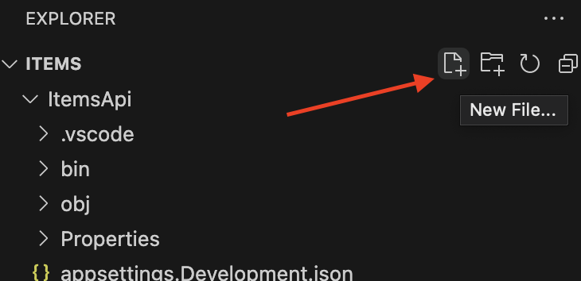
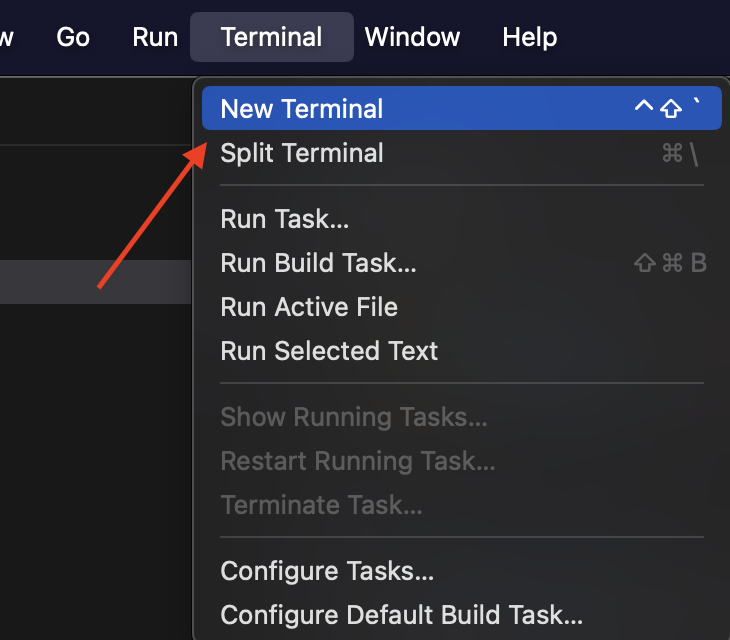
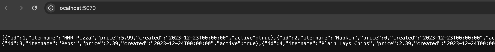

# LearnPostgres and .NET
This project exists to help keep track of learning some of the basics of making .NET API that connects to a postgres database. Much of this tutorial followrs the standard [Minimal api guide](https://learn.microsoft.com/en-us/aspnet/core/tutorials/min-web-api?view=aspnetcore-8.0&tabs=visual-studio-code) and also uses this [guide](https://jasonwatmore.com/post/2022/06/23/net-6-connect-to-postgresql-database-with-entity-framework-core) to help with connecting to the postgres database

## Step 0. Installation
So since we are focused on building a very basic and simple API we will limit this guide to only free tools. We will use [Visual Studio Code](https://code.visualstudio.com/download) as our IDE/Text Editor to build the code files we need. This article will not act a full guide for installing VS Code and will assume moving forward it is installed correctly.

Below are a few scripts we will want to run in our terminal window in order to make using our projects easier. While VS Code will be our editor of choice we will use our Mac Terminal to do some early set up. This can be found by pressing command+space on a Mac and then search the words Terminal and the Terminal.app should be the main option. Once it's open run the below commands
```
dotnet tool install -g dotnet-ef
dotnet add package Npgsql.EntityFrameworkCore.PostgreSQL
dotnet add package Microsoft.EntityFrameworkCore.InMemory --prerelease
dotnet add package Microsoft.AspNetCore.Diagnostics.EntityFrameworkCore --prerelease
```
Next run the below commands once the project has been complete. 
```
dotnet new web -o ItemsApi
cd ItemsApi
code -r ../ItemsApi
```
Now that those are done open the file explorer options to the folder your project was created in.

## Step 1. Model Creation
First we will need to create a custom data type to act as the structure for our data as we retrieve from out database. Since our record needs to represent our database column we need to give the record properties that match with the data types and names of the columns.
Click on the New File button and create a new File called Item.cs under the ItemsApi folder.

```C#
[Table("items")]
public sealed record Item
{
    public int id {get;init;}
    public string itemname {get;init;} = string.Empty;
    public decimal price {get;init;}

    public DateTime created {get;init;}

    public bool active {get;init;}
}
```
## Step 2. DbContext
Next we will build ourselves a database context which we will use to house our connection to the database. A ef core database context will act as a class responsible for the database connection. Like the steps above we will create a brand new file in the ItemsApi folder this time called ItemsDbContext.cs.
```C#
using System.ComponentModel.DataAnnotations.Schema;
using Microsoft.EntityFrameworkCore;
public sealed class ItemsDbContext : DbContext
{
public ItemsDbContext(DbContextOptions<ItemsDbContext> options) : base(options){}
public DbSet<Item> Items => Set<Item>();

}
```
# Step 3. AppSettings
The AppSettings.json file is a simple json file that will contain the confirguation that our API will need. In this case we will use the file to keep track of our database connection string. So you will need to copy the Appsettings file below.
```JSON
{
  "Logging": {
    "LogLevel": {
      "Default": "Information",
      "Microsoft.AspNetCore": "Warning"
    }
  },
  "AllowedHosts": "*", "ConnectionStrings": {
    "ItemsDatabase": "Server=localhost;Port=5432;Database=template1;"
  }
}

```
# Step 4. Program
Our next steps will be to update our program file and provide the instructions for our base API. Make adjustments to allow your program file to look like the one shown below.
```C#
using Microsoft.EntityFrameworkCore;
var builder = WebApplication.CreateBuilder(args);
builder.Services.AddDbContext<ItemsDbContext>(options => 
    options.UseNpgsql(builder.Configuration.GetConnectionString("ItemsDatabase")));
var app = builder.Build();

app.MapGet("/", async (ItemsDbContext dbContext) => 
Results.Ok(await dbContext.Items.ToListAsync()));

app.Run();

```
# Step 5. Run the API
Finally we will run the below command in our terminal and run our API. Visual Studio Code has a built in Terminal to assist us not navigating multiple App windows. 

```
dotnet watch run
```
If everything is running successfully then typing the above command in the terminal that opens followed but enter should attempt to up the default brower and display data like in the screenshot below.
